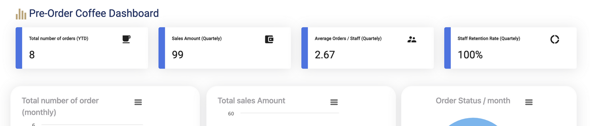
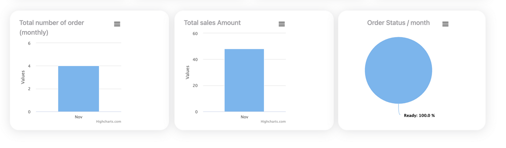

# Data Dashboard by Angular

Welcome to the Comprehensive Data Dashboard project! This dashboard is designed to offer a comprehensive overview and detailed insights into your data using powerful data visualization tools like charts and graphs. It provides a visually appealing and intuitive interface that enables users to analyze complex information effortlessly.

## Features

- **Total Number**: Shows how many orders has been made since the begging of a certain year.


- **Average**: Calculates the average each quarter of the year.

- **Retention**: Shows returning person to use the feature.

- **Bar Chart**: Describe total items month by month.

- **Pie Chart**: Shows percentage of all new and canceled items through app.


## Development phase
**Summary section:**

- Summary: Using staff service to obtain the data, do the required calculation in order to get the Total - number of orders, sales Amount, average order/staff, and staff retention.
Cards: a reusable card that will accept a ( title, number, and icon) as inputs. 




**Details section:**

- Data:
Using a merchant service to obtain the data (number of orders, sales Amount, order status), storing it in an array, and then calling three methods to create the below charts.
- Pie chart:
Order status monthly
- Bar chart :
total sales amount
Total number of items monthly
- Map: 
using google map to show the total number of items by moving the pointer over cafe location





   ```

